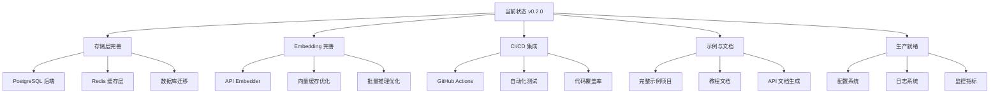

# Nexa-net 下一步完善计划 (v0.3.0)

## 当前状态总结

### 已完成 (v0.1.0 - v0.2.0)
- ✅ 核心四层架构 (Identity, Discovery, Transport, Economy)
- ✅ Embedding 集成 (Mock + ONNX)
- ✅ Memory Store 持久化
- ✅ Criterion 性能基准测试
- ✅ 安全模块 (审计、密钥轮换、速率限制、加密存储)
- ✅ 130+ 单元测试，15+ 集成测试

### 待完善领域



---

## Phase 1: 存储层完善 (优先级: 高)

### 1.1 PostgreSQL 后端实现

**目标**: 实现生产级 PostgreSQL 存储后端

**任务清单**:
- [ ] 创建 `src/storage/postgres/mod.rs`
- [ ] 实现 `PostgresStore` 结构体
- [ ] 实现 Capability 存储
- [ ] 实现 Channel 存储
- [ ] 实现 Receipt 存储
- [ ] 连接池管理
- [ ] 事务支持

**代码结构**:
```
src/storage/postgres/
├── mod.rs           # PostgresStore 主实现
├── capabilities.rs  # Capability 存储操作
├── channels.rs      # Channel 存储操作
└── receipts.rs      # Receipt 存储操作
```

**数据库 Schema**:
```sql
-- migrations/001_initial.sql
CREATE TABLE capabilities (
    did VARCHAR(128) PRIMARY KEY,
    schema JSONB NOT NULL,
    quality JSONB DEFAULT '{}',
    available BOOLEAN DEFAULT true,
    registered_at TIMESTAMP DEFAULT NOW(),
    updated_at TIMESTAMP DEFAULT NOW()
);

CREATE TABLE channels (
    id VARCHAR(64) PRIMARY KEY,
    party_a VARCHAR(128) NOT NULL,
    party_b VARCHAR(128) NOT NULL,
    balance_a BIGINT NOT NULL,
    balance_b BIGINT NOT NULL,
    state VARCHAR(32) NOT NULL,
    created_at TIMESTAMP DEFAULT NOW(),
    updated_at TIMESTAMP DEFAULT NOW()
);

CREATE TABLE receipts (
    id SERIAL PRIMARY KEY,
    call_id VARCHAR(64) NOT NULL,
    payer_did VARCHAR(128) NOT NULL,
    payee_did VARCHAR(128) NOT NULL,
    amount BIGINT NOT NULL,
    created_at TIMESTAMP DEFAULT NOW()
);
```

### 1.2 Redis 缓存层实现

**目标**: 实现高性能 Redis 缓存层

**任务清单**:
- [ ] 创建 `src/storage/redis/mod.rs`
- [ ] 实现 `RedisCache` 结构体
- [ ] 向量缓存 (embedding 结果)
- [ ] 能力缓存 (热点数据)
- [ ] 会话缓存
- [ ] 分布式锁实现

**代码结构**:
```
src/storage/redis/
├── mod.rs       # RedisCache 主实现
├── cache.rs     # 通用缓存操作
├── vectors.rs   # 向量缓存
└── locks.rs     # 分布式锁
```

---

## Phase 2: Embedding 完善 (优先级: 中)

### 2.1 API Embedder 实现

**目标**: 支持远程 Embedding API 调用

**任务清单**:
- [ ] 创建 `src/discovery/embedding/api.rs`
- [ ] 实现 `ApiEmbedder` 结构体
- [ ] HTTP 客户端集成 (reqwest)
- [ ] 批量请求优化
- [ ] 错误重试机制
- [ ] 成本追踪

**支持的服务**:
- OpenAI Embeddings API
- Cohere Embed API
- 自定义 Embedding 服务

### 2.2 向量缓存优化

**目标**: 减少 Embedding 计算开销

**任务清单**:
- [ ] LRU 缓存实现
- [ ] 文本哈希缓存键
- [ ] 缓存命中率统计
- [ ] 缓存预热机制

---

## Phase 3: CI/CD 集成 (优先级: 高)

### 3.1 GitHub Actions 工作流

**目标**: 自动化测试和发布流程

**任务清单**:
- [ ] 创建 `.github/workflows/ci.yml`
- [ ] 自动运行测试
- [ ] 代码覆盖率报告
- [ ] 自动发布到 crates.io

**工作流配置**:
```yaml
# .github/workflows/ci.yml
name: CI

on:
  push:
    branches: [main]
  pull_request:
    branches: [main]

jobs:
  test:
    runs-on: ubuntu-latest
    steps:
      - uses: actions/checkout@v4
      - uses: actions-rust-lang/setup-rust-toolchain@v1
      - run: cargo test --all-features
      - run: cargo clippy -- -D warnings
      
  coverage:
    runs-on: ubuntu-latest
    steps:
      - uses: actions/checkout@v4
      - run: cargo tarpaulin --out Xml
      - uses: codecov/codecov-action@v3
```

### 3.2 代码质量检查

- [ ] Clippy 配置优化
- [ ] rustfmt 配置
- [ ] deny.toml (依赖安全检查)
- [ ] MSRV 检查

---

## Phase 4: 示例与文档 (优先级: 中)

### 4.1 完整示例项目

**目标**: 提供可运行的示例代码

**任务清单**:
- [ ] 创建 `examples/` 目录
- [ ] 基础示例: 身份创建与认证
- [ ] 发现示例: 服务注册与发现
- [ ] 经济示例: 支付通道操作
- [ ] 完整示例: 端到端 Agent 通信

**示例结构**:
```
examples/
├── basic_identity.rs    # 身份基础
├── service_discovery.rs # 服务发现
├── payment_channel.rs   # 支付通道
└── full_workflow.rs     # 完整流程
```

### 4.2 教程文档

- [ ] 快速入门教程
- [ ] 架构深入教程
- [ ] 最佳实践指南
- [ ] 故障排查指南

---

## Phase 5: 生产就绪 (优先级: 中)

### 5.1 配置系统

**目标**: 灵活的配置管理

**任务清单**:
- [ ] 创建 `src/config/mod.rs`
- [ ] YAML/TOML 配置支持
- [ ] 环境变量覆盖
- [ ] 配置验证
- [ ] 热重载支持

**配置示例**:
```yaml
# config.yaml
server:
  http_addr: "0.0.0.0:7070"
  grpc_addr: "0.0.0.0:7071"

embedding:
  backend: "onnx"
  model_path: "./models/all-MiniLM-L6-v2"
  cache_size: 10000

storage:
  postgres_url: "postgres://localhost/nexa"
  redis_url: "redis://localhost:6379"

security:
  audit_enabled: true
  rate_limit:
    requests_per_minute: 60
```

### 5.2 日志系统

**目标**: 结构化日志输出

**任务清单**:
- [ ] tracing 集成优化
- [ ] 日志级别配置
- [ ] 结构化日志格式 (JSON)
- [ ] 日志轮转配置

### 5.3 监控指标

**目标**: Prometheus 指标暴露

**任务清单**:
- [ ] 创建 `src/metrics/mod.rs`
- [ ] 请求计数器
- [ ] 延迟直方图
- [ ] 错误率追踪
- [ ] 资源使用监控

---

## 实施优先级

| Phase | 优先级 | 预计工作量 | 依赖 |
|-------|--------|------------|------|
| Phase 1: 存储层完善 | 高 | 3-5 天 | 无 |
| Phase 3: CI/CD 集成 | 高 | 1-2 天 | 无 |
| Phase 4: 示例与文档 | 中 | 2-3 天 | 无 |
| Phase 5: 生产就绪 | 中 | 2-3 天 | Phase 1 |
| Phase 2: Embedding 完善 | 中 | 2-3 天 | 无 |

---

## 建议实施顺序

1. **Phase 3: CI/CD 集成** - 确保代码质量
2. **Phase 1: 存储层完善** - 核心功能增强
3. **Phase 4: 示例与文档** - 提升可用性
4. **Phase 5: 生产就绪** - 运维支持
5. **Phase 2: Embedding 完善** - 性能优化

---

## 下一步行动

建议从 **Phase 3: CI/CD 集成** 开始，因为：
1. 工作量小，可快速完成
2. 为后续开发提供质量保障
3. 自动化测试和发布流程

是否开始实施？请确认优先级和顺序。