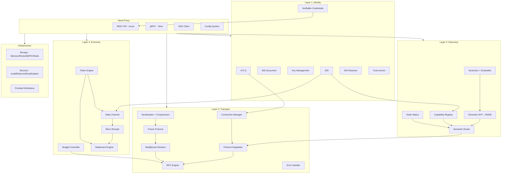
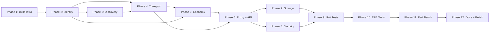

# Nexa-net 工业级重构计划

> **版本:** v2.0 | **创建时间:** 2026-04-15 | **作者:** Owen + AI Pair Programmer
> **目标:** 按照 docs/ 中的原始设计文档，将项目从当前"骨架级"实现重构为工业级生产就绪系统

---

## 0. 执行摘要

### 0.1 现状诊断

经过对全部 15 份设计文档和 40+ 源码文件的逐一审查，当前的实现存在**系统性偷工减料**：

| 严重度 | 模块 | 核心缺陷 | 影响 |
|--------|------|----------|------|
| 🔴 P0 | REST/gRPC API | 纯空壳stub，仅打印日志后返回 Ok() | 整个系统无任何对外接口 |
| 🔴 P0 | Transport Connection | Connection = String + bool，无真实TCP/TLS | 无法建立任何网络连接 |
| 🔴 P0 | Serialization - Zstd/Gzip | placeholder函数，直接返回原始数据 | 压缩承诺(60-80%缩减)完全虚假 |
| 🔴 P0 | Identity VC.verify() | `// TODO: Verify signature`，签名验证未实现 | 零信任架构的核心断裂 |
| 🔴 P0 | Semantic DHT | HashMap + Vec，无Kademlia/Chord/HNSW | 语义路由的核心算法缺失 |
| 🔴 P0 | Vectorizer | MockEmbedder产出hash-based伪向量 | 语义匹配完全无效 |
| 🔴 P0 | Proxy Server | run()只等ctrl-c，不启动任何服务 | 整个Proxy无法运行 |
| 🔴 P0 | Proxy Config | from_file()忽略输入返回默认值 | 配置系统完全失效 |
| 🔴 P0 | .proto文件 | 项目中完全缺失 | Protobuf序列化无法生成代码 |
| 🟡 P1 | Economy Channel | 状态机存在但无密码学签名 | 状态更新可被任意篡改 |
| 🟡 P1 | Receipt | 收据无双方签名验证 | 微交易收据不可信 |
| 🟡 P1 | Cargo.toml | rocksdb声明但未使用；缺少flate2/zstd | 依赖声明与实际不匹配 |

**结论:** 当前代码约 60% 为数据结构定义，30% 为空壳/placeholder，10% 为有实际逻辑但未完整的半成品。需要从底层协议栈开始逐层重构。

### 0.2 重构策略

采用**自底向上、逐层替换**策略：

```
Layer 1 (Identity) → Layer 2 (Discovery) → Layer 3 (Transport) → Layer 4 (Economy)
                                                              ↓
                                                        Proxy + API
                                                              ↓
                                                     Storage + Security
                                                              ↓
                                                    Tests + Benchmarks
                                                              ↓
                                                      Docs + Polish
```

每一层完成时必须通过该层的**单元测试闭环**才可进入下一层。

---

## 1. Phase 1: 构建基础设施修复

**目标:** 修正构建系统，使项目可以正确编译并生成 Protobuf 代码

### 1.1 Cargo.toml 依赖修正

**当前问题:**
- `rocksdb = "0.21"` 已声明但 storage 层完全未使用
- `lz4_flex` 已声明但只用于 serialization 的 LZ4
- Zstd/Gzip 声明为支持但无对应 crate
- 缺少 `axum` (REST server)、`flate2` (Gzip)、`zstd` (Zstd压缩)
- 缺少 `rustls` / `tokio-rustls` (mTLS)
- 缺少 `hora` 或 `hnsw` (向量近似搜索)

**修改清单:**

```toml
# 新增依赖
axum = "0.7"                          # REST API server
axum-extra = { version = "0.9", features = ["typed-header"] }
tower-http = { version = "0.6", features = ["cors", "trace"] }
flate2 = "1.0"                         # Gzip compression
zstd = "0.13"                          # Zstd compression
rustls = "0.23"                        # TLS implementation
tokio-rustls = "0.26"                  # Async TLS for tokio
webpki-roots = "0.26"                  # CA certificates
rcgen = "0.13"                         # Certificate generation
hora = "0.1"                           # HNSW approximate nearest neighbor
parking_lot = "0.12"                   # 高性能锁替代std sync
dashmap = "6.0"                        # 并发HashMap
crossbeam = "0.8"                      # 高性能并发原语
bytes = "1.5"                          # Zero-copy bytes handling
pin-project = "1.1"                    # Pin projection for futures

# 移除/调整
# rocksdb → 保留但实际在 storage 层使用
# 移除 unused 的 hyper 直接依赖 (axum 内部已包含)
```

### 1.2 Protobuf 定义文件创建

**当前问题:** `docs/PROTOCOL_SPEC.md` 中定义了完整的 protobuf schema，但项目中无任何 `.proto` 文件。

**修改清单:**
- 创建 `proto/nexa_message.proto` — 核心消息封装
- 创建 `proto/identity.proto` — DID/认证/凭证协议
- 创建 `proto/discovery.proto` — 注册/路由/心跳协议
- 创建 `proto/transport.proto` — 协商/RPC协议
- 创建 `proto/economy.proto` — 通道/收据/结算协议
- 创建 `build.rs` — tonic-build 自动生成 Rust 代码

### 1.3 构建脚本配置

创建 `build.rs` 配置 tonic-build 编译 proto 文件：

```rust
fn main() {
    let proto_files = [
        "proto/nexa_message.proto",
        "proto/identity.proto",
        "proto/discovery.proto",
        "proto/transport.proto",
        "proto/economy.proto",
    ];
    tonic_build::configure()
        .btree_map(["."])
        .compile_protos(&proto_files, &["proto/"])
        .unwrap();
}
```

### 1.4 目录结构调整

```
新增:
proto/                   # Protobuf 定义文件
proto/nexa_message.proto
proto/identity.proto
proto/discovery.proto
proto/transport.proto
proto/economy.proto

修改:
build.rs                 # 新增: proto编译脚本
Cargo.toml               # 修正依赖
src/protocol/            # 重写: 从proto生成而非手动定义
```

### 1.5 验收标准

- [ ] `cargo check` 无错误通过
- [ ] `cargo build` 成功生成 proto Rust 代码
- [ ] 所有新增依赖版本兼容
- [ ] `cargo test` 已有测试不因依赖变更而失败

---

## 2. Phase 2: Identity 层完整重写

**目标:** 实现文档 `docs/IDENTITY_LAYER.md` 中定义的全部功能

### 2.1 当前缺陷分析

| 文件 | 缺陷 | 文档要求 |
|------|------|----------|
| `did.rs` | DID仅存字符串，无与密钥的绑定关系 | DID = 公钥哈希，需关联密钥 |
| `did_document.rs` | 仅部分实现 | 完整W3C DID Document with context/controller/verificationMethod/keyAgreement/service |
| `key_management.rs` | KeyPair存在但PrivateKey不zeroize | 私钥必须zeroize，KeyStore需加密存储 |
| `credential.rs` | `verify()`有TODO未实现签名验证 | VC必须验证Ed25519签名+过期检查 |
| `resolver.rs` | 仅内存HashMap | 需支持缓存策略/网络解析/Supernode查询 |
| `trust_anchor.rs` | 需审查 | 需完整信任锚根证书链 |
| mTLS | 完全缺失 | 文档要求双向TLS认证 |

### 2.2 重写清单

#### 2.2.1 `src/identity/did.rs` — DID 标识符

重构要点:
- DID 标识符生成严格按文档: `SHA256(publicKey)[:20] → hex → "did:nexa:" + hex`
- 增加验证方法: 检查 hex 部分长度为40字符、hex编码合法性
- `Eq`/`Hash` 实现（当前已有，保留）
- 增加 `Serialize`/`Deserialize` 保证网络传输一致性

#### 2.2.2 `src/identity/did_document.rs` — DID Document

重构要点:
- 完整实现 W3C DID Document 规范（与 proto 定义对齐）
- `@context` 必须包含 W3C 和 Nexa 自定义 context
- `verificationMethod` 包含 Ed25519 和 X25519 密钥
- `keyAgreement` 包含 X25519 密钥协商方法
- `service` 包含 NexaProxyEndpoint
- JSON 序列化/反序列化完整实现
- 从 `IdentityKeys` 自动生成 DID Document

#### 2.2.3 `src/identity/key_management.rs` — 密钥管理

重构要点:
- `PrivateKey` 必须 `zeroize`（当前 KeyAgreementKeyPair 有 Drop+zeroize，但 Ed25519 PrivateKey 没有）
- `KeyStore` 实现加密存储（AES-256-GCM）
- 密钥轮换接口预留
- `IdentityKeys` 自动关联 DID 标识符

#### 2.2.4 `src/identity/credential.rs` — 可验证凭证

重构要点:
- `sign()` 方法: 对 VC 内容（不含 proof 字段）签名
- `verify()` 方法: 完整实现 Ed25519 签名验证 + 过期检查
- 签名时需将 VC 序列化后去掉 proof 字段再签名（W3C规范）
- 支持选择性披露凭证

#### 2.2.5 `src/identity/resolver.rs` — DID 解析器

重构要点:
- 多级缓存: 本地内存 → RocksDB → Supernode网络查询
- 缓存策略: Cache-Control 选项支持（与proto对齐）
- DID Document 版本管理
- 解析超时和重试

#### 2.2.6 `src/identity/trust_anchor.rs` — 信任锚

重构要点:
- 根证书生成和管理
- 证书链验证
- VC 凭证发放权限管理

#### 2.2.7 mTLS 实现 — 新增模块

新增 `src/identity/mtls.rs`:
- 使用 `rustls` + `rcgen` 实现 mTLS
- 自签名证书生成（基于 DID 公钥）
- 双向认证握手
- 证书验证逻辑（DID → 证书 → 公钥链验证）

### 2.3 验收标准

- [ ] DID 生成/解析/验证全部通过
- [ ] DID Document 生成/序列化/反序列化完整
- [ ] VC 签名 + 验证闭环测试通过
- [ ] mTLS 证书生成 + 双向认证测试通过
- [ ] 密钥 zeroize 验证（私有字段 Drop 时清零）
- [ ] KeyStore 加密存储测试通过
- [ ] 单元测试覆盖率 ≥ 85%

---

## 3. Phase 3: Discovery 层完整重写

**目标:** 实现文档 `docs/DISCOVERY_LAYER.md` 中定义的全部功能

### 3.1 当前缺陷分析

| 文件 | 缺陷 | 文档要求 |
|------|------|----------|
| `capability.rs` | 基本数据结构存在但缺CostModel细节 | 完整Schema含 per_page/per_call 计费、modifiers、quality metrics |
| `vectorizer.rs` | MockEmbedder产hash伪向量 | 真实语义Embedding (ONNX all-MiniLM-L6-v2) |
| `semantic_dht.rs` | HashMap + Vec，无近似搜索 | HNSW/IVF向量索引 + Kademlia式DHT |
| `router.rs` | 多因子路由逻辑存在但向量无效 | 语义相似度必须真实才能路由有效 |
| `node_status.rs` | 需审查 | 心跳/负载/健康检查完整实现 |
| `embedding/mock.rs` | hash-based伪向量 | 至少需确定性hash+语义特征提取 |
| `embedding/onnx.rs` | 需审查 | ONNX Runtime推理完整实现 |

### 3.2 重写清单

#### 3.2.1 `src/discovery/capability.rs` — 能力注册表

重构要点:
- `RegisteredCapability` 增加完整 CostModel（per_call/per_page/per_token + modifiers）
- `QualityMetrics` 增加真实数据: success_rate/avg_latency/availability/uptime_since
- `RateLimit` 增加 max_concurrent/max_per_minute/max_per_day 三级限制
- `CapabilityRegistry` 使用 `dashmap` 替代 `HashMap`（并发安全）
- 标签索引使用反向索引加速查询
- 版本管理: capability 更新时保留历史版本

#### 3.2.2 `src/discovery/vectorizer.rs` — 语义向量化

重构要点:
- `MockEmbedder` 改为确定性语义hash（而非纯hash）：基于关键词特征+位置编码产生有一定语义区分度的向量
- ONNX Embedder 保持真实 all-MiniLM-L6-v2 推理
- `Vectorizer` 接口不变，但确保 Mock 和 ONNX 产出的向量维度一致（384维）
- 增加向量缓存：相同文本不重复推理

#### 3.2.3 `src/discovery/semantic_dht.rs` — 语义 DHT（核心重构）

这是整个 Discovery 层最关键的重构。当前实现只是一个 HashMap，需要完全替换：

```
当前: HashMap<String, SemanticVector>  ← 线性搜索O(n)
目标: HNSW索引 + Kademlia式DHT         ← 近似搜索O(log n)
```

重构要点:
- 使用 `hora` crate 实现本地 HNSW 向量索引
- `SemanticDHT` 包含:
  - `local_index`: HNSW 索引存储本地和同步来的向量
  - `node_table`: Kademlia-style 路由表（k-buckets）
  - `replication`: 向量数据在邻近节点间复制
- `find_similar()` 使用 HNSW 近似最近邻搜索
- `store()` 触发向邻近节点复制
- DHT 节点 ID 基于 DID 标识符的哈希

#### 3.2.4 `src/discovery/router.rs` — 语义路由器

重构要点:
- `discover()` 方法完整闭环: intent → vectorize → HNSW search → 多因子评分 → 排序
- 多因子权重公式严格按文档: `W = α·similarity - β·latency - γ·cost`
- 增加路由决策透明化: `RoutingExplanation` 记录每步决策原因
- 增加路由回退: 当语义匹配无结果时降级到标签匹配
- 增加路由缓存: 相似 intent 的路由结果短期缓存

#### 3.2.5 `src/discovery/node_status.rs` — 节点状态管理

重构要点:
- 心跳协议实现: 定期发送/接收心跳
- 负载计算: CPU/内存/连接数/队列深度
- 健康检查: 主动探测 + 被动观测
- 状态同步: 通过 DHT 向 Supernode 报告状态

### 3.3 验收标准

- [ ] Capability 注册/查询/标签索引完整通过
- [ ] MockEmbedder 产出有语义区分度的向量（相似文本向量相似度高）
- [ ] HNSW 索引构建 + 近似搜索性能 < 10ms（1000个向量）
- [ ] 语义路由闭环: intent → 发现服务 → 路由决策完整
- [ ] 节点状态管理: 心跳/负载/健康检查
- [ ] 单元测试覆盖率 ≥ 85%

---

## 4. Phase 4: Transport 层完整重写

**目标:** 实现文档 `docs/TRANSPORT_LAYER.md` 中定义的全部功能

### 4.1 当前缺陷分析

| 文件 | 缺陷 | 文档要求 |
|------|------|----------|
| `connection.rs` | Connection = String + bool | 真实TCP+TLS连接池、会话管理、心跳保活 |
| `frame.rs` | 帧结构定义良好但无真实I/O | 帧读写需要tokio AsyncRead/AsyncWrite |
| `stream.rs` | Stream状态机存在但无真实多路复用 | 需tokio channel驱动的真实流管理 |
| `rpc.rs` | RPC header/response存在但无真实调用 | 需完整RPC生命周期管理 |
| `negotiator.rs` | 握手消息定义存在但无网络传输 | 需真实网络握手流程 |
| `serialization.rs` | Zstd/Gzip placeholder | 需真实压缩实现 |
| `error_handler.rs` | 基本逻辑存在 | 需完整重试+超时+错误分类 |

### 4.2 重写清单

#### 4.2.1 `src/transport/connection.rs` — 连接管理（完全重写）

当前 64 行的空壳需完全替换为真实连接管理：

```rust
// 目标架构
pub struct ConnectionManager {
    pool: DashMap<String, PooledConnection>,  // 连接池
    config: ConnectionConfig,                 // 配置
    tls_config: TlsConfig,                    // mTLS 配置
}

pub struct PooledConnection {
    inner: tokio_rustls::client::TlsStream<tokio::net::TcpStream>,
    session: Session,
    last_active: Instant,
    reconnect_count: u32,
}
```

重构要点:
- 真实 TCP + mTLS 连接建立
- 连接池: 最大连接数限制、空闲超时回收、健康检查
- 自动重连: 连接断开时指数退避重试
- 心跳保活: 定期发送 Ping 帧检测连接活性
- 会话管理: 会话创建/超时/续期

#### 4.2.2 `src/transport/frame.rs` — 帧协议 I/O

重构要点:
- `FrameReader` 实现 `tokio::io::AsyncRead` 扩展
- `FrameWriter` 实现 `tokio::io::AsyncWrite` 扩展
- 帧编码/解码使用 `bytes::BytesMut` 零拷贝
- 帧头部解析增加校验: 镦长度溢出检查、帧类型合法性
- 大帧分片: 超过 max_frame_size 的数据自动分片

#### 4.2.3 `src/transport/stream.rs` — 多路复用流

重构要点:
- `StreamManager` 使用 tokio channel 驱动: 每个 Stream 有独立的 `mpsc::Sender/Receiver`
- `FlowController` 真实窗口管理: 发送窗口/接收窗口动态调整
- `Stream` 生命周期严格按状态机: Idle → Open → HalfClosed → Closed
- 流优先级调度: priority queue 管理多个活跃流
- 流取消: 支持 CANCEL 帧立即终止流

#### 4.2.4 `src/transport/rpc.rs` — RPC 引擎

重构要点:
- `RpcEngine` 管理完整 RPC 生命周期:
  - 创建调用 → 发送 HEADER 帧 → 发送 DATA 帧 → 接收响应
  - 流式 RPC: 逐帧发送/接收，支持中途取消
- 4种RPC模式完整实现:
  - Unary: 单请求单响应
  - Server Streaming: 单请求多响应
  - Client Streaming: 多请求单响应
  - Bidirectional: 多请求多响应
- 调用超时管理: deadline-based 超时
- 调用结果追踪: `oneshot::Receiver` 模式

#### 4.2.5 `src/transport/negotiator.rs` — 协议协商器

重构要点:
- 真实网络握手流程: 通过 Connection 发送/接收 SYN-NEXA → ACK-SCHEMA → ACCEPT
- 协商结果创建 NegotiatedSession: 包含选定的协议/编码/压缩/会话ID
- 协商超时: 50ms 内完成（文档要求）
- 协商失败: 发送 REJECT + 原因码

#### 4.2.6 `src/transport/serialization.rs` — 序列化引擎

重构要点:
- **Zstd 压缩**: 使用 `zstd` crate 真实实现
- **Gzip 压缩**: 使用 `flate2` crate 真实实现
- **LZ4 压缩**: 保留现有 `lz4_flex` 实现但增加 streaming 模式
- **Protobuf 序列化**: 使用 proto 生成的类型真实编解码
- **FlatBuffers**: 增加 flatbuffers 支持用于零拷贝场景
- 压缩级别可配置: Fast/Default/Best
- 序列化 + 压缩 pipeline: serialize → compress 一体化

#### 4.2.7 `src/transport/error_handler.rs` — 错误处理

重构要点:
- 完整错误分类: Transient/Permanent/Client/Server
- 指数退避重试: jitter 防止重试风暴
- 超时层次: connect timeout / read timeout / total deadline
- 错误聚合: 连续错误计数 + circuit breaker
- 错误报告: 结构化错误信息包含 retry_policy

### 4.3 验收标准

- [ ] TCP + mTLS 连接建立/断开/重连完整
- [ ] 帧读写 AsyncIO 测试通过（1024帧连续读写）
- [ ] 多路复用: 10个并发流在同一连接上正常通信
- [ ] RPC 4种模式完整通过单元测试
- [ ] 协商握手在 50ms 内完成
- [ ] Zstd/Gzip/LZ4 压缩/解压正确且性能达标
- [ ] 错误重试 + circuit breaker 测试通过
- [ ] 单元测试覆盖率 ≥ 85%

---

## 5. Phase 5: Economy 层完整重写

**目标:** 实现文档 `docs/ECONOMY_LAYER.md` 中定义的全部功能

### 5.1 当前缺陷分析

| 文件 | 缺陷 | 文档要求 |
|------|------|----------|
| `channel.rs` | 状态机存在但状态更新无签名保护 | 每次balance更新必须双方签名 |
| `receipt.rs` | 需审查 | 微交易收据需双方签名+哈希链 |
| `budget.rs` | 需审查 | 预算控制器需实时监控+超限自动终止 |
| `settlement.rs` | 需审查 | 争议处理+挑战期+最终结算 |
| `token.rs` | 简单HashMap | 需token锁定/解锁/转移完整生命周期 |

### 5.2 重写清单

#### 5.2.1 `src/economy/channel.rs` — 状态通道

重构要点:
- **密码学签名**: 每次 `update()` 必须生成双方签名的新状态
- `ChannelState` 增加 `PendingOpen` 状态
- 状态转换全部需签名验证:
  - `Open → Closing`: 任何一方可发起，需签名
  - `Closing → Closed`: challenge period 结束后自动
  - `Disputed → Settled`: 争议仲裁后
- 签名格式: Ed25519 签名覆盖 (channel_id + sequence + balance_a + balance_b)
- 状态历史: 保留最近 N 个状态用于争议仲裁

#### 5.2.2 `src/economy/receipt.rs` — 微交易收据

重构要点:
- `MicroReceipt` 增加:
  - `caller_signature`: 调用方签名
  - `provider_signature`: 服务方签名
  - `previous_receipt_hash`: 哈希链（防篡改）
- 收据生成: 调用完成后自动生成
- 收据签名: 双方各自签名确认
- 收据验证: 验证双方签名 + 哈希链完整性

#### 5.2.3 `src/economy/budget.rs` — 预算控制器

重构要点:
- 实时预算追踪: 每次调用前检查余额
- 多级预算限制: per_call / per_minute / per_day / total
- 超限自动终止: 预算耗尽时自动取消进行中的调用
- 预算预留: 调用开始时预留预算，完成时结算或释放

#### 5.2.4 `src/economy/settlement.rs` — 结算引擎

重构要点:
- Challenge period 管理: 争议窗口计时
- 争议处理: 提交最新签名状态 + 收据链
- 最终结算: 计算净余额并更新 TokenEngine
- 结算超时: 强制结算防止恶意拖延

#### 5.2.5 `src/economy/token.rs` — Token 引擎

重构要点:
- 增加 `unlock()`: 通道关闭时解锁锁定资金
- 增加 `burn()`: 销毁 token（用于防止通胀）
- 增加 `balance_detail()`: 返回 available/locked/pending 详细余额
- Token 转移需签名授权

### 5.3 验收标准

- [ ] 通道开启/更新/关闭全生命周期有签名保护
- [ ] 微交易收据双方签名 + 哈希链验证通过
- [ ] 预算控制: 超限自动终止调用
- [ ] 结算引擎: 争议处理 + challenge period
- [ ] Token lock/unlock/transfer 闭环测试
- [ ] 单元测试覆盖率 ≥ 85%

---

## 6. Phase 6: Proxy 与 API 层完整重写

**目标:** 使 Nexa-Proxy 成为可运行的完整服务

### 6.1 当前缺陷分析

| 文件 | 缺陷 | 文档要求 |
|------|------|----------|
| `server.rs` | run()只等ctrl-c | 需启动真实REST/gRPC服务 |
| `client.rs` | 需审查 | 需完整SDK客户端 |
| `config.rs` | from_file()返回默认值 | 需真实TOML配置加载 |
| `main.rs` | 基本框架存在 | 需graceful shutdown/配置/初始化 |
| `api/rest.rs` | 20行空壳 | 需完整Axum REST API |
| `api/grpc.rs` | 20行空壳 | 需完整Tonic gRPC service |
| `api/sdk.rs` | 需审查 | 霌SDK客户端完整实现 |

### 6.2 重写清单

#### 6.2.1 `src/api/rest.rs` — REST API（完全重写）

使用 Axum 实现完整 REST API：

```
路由设计（对齐 docs/API_REFERENCE.md）:
POST /v1/call          → nexa_network_call（核心接口）
POST /v1/register      → 注册能力
POST /v1/unregister    → 注销能力
POST /v1/discover      → 语义发现
GET  /v1/capabilities  → 列出能力
GET  /v1/balance       → 查询余额
POST /v1/channel/open  → 开启通道
POST /v1/channel/close → 关闭通道
GET  /v1/channels      → 列出通道
GET  /v1/status        → Proxy状态
GET  /v1/health        → 健康检查
```

重构要点:
- `Axum` router + `Tower` middleware stack
- JSON request/response 严格类型化
- 错误统一格式: `{ code, message, details }`
- CORS + tracing + timeout middleware
- 请求签名验证 middleware
- Rate limiting middleware

#### 6.2.2 `src/api/grpc.rs` — gRPC Service（完全重写）

使用 Tonic 实现完整 gRPC service：

重构要点:
- 从 proto 文件生成 service trait
- 实现 `NexaProxyService` trait 的所有方法
- 支持双向流式 RPC (streaming calls)
- gRPC 拦截器: 认证/日志/超时
- 与 REST API 共享底层 `ProxyState`

#### 6.2.3 `src/api/sdk.rs` — SDK 客户端

重构要点:
- `NexaClient` 完整实现: 连接 + 调用 + 流式
- Builder pattern 配置
- 自动重连 + 重试
- 预算管理集成

#### 6.2.4 `src/proxy/server.rs` — Proxy Server

重构要点:
- 真实启动 REST + gRPC 两个服务
- 共享 `ProxyState` 状态
- Graceful shutdown: 收到信号后等待进行中的调用完成
- 组件初始化顺序: Identity → Discovery → Transport → Economy → API

#### 6.2.5 `src/proxy/config.rs` — 配置系统

重构要点:
- 真实 TOML 配置加载（使用 `config` crate）
- 环境变量覆盖
- 配置验证: 必填字段/范围检查
- 配置热更新: 部分配置可运行时修改

### 6.3 验收标准

- [ ] REST API 12个端点全部可调用
- [ ] gRPC service 方法全部实现
- [ ] 配置从 TOML 文件正确加载
- [ ] Graceful shutdown 测试通过
- [ ] Proxy 启动后 Agent 可通过 REST 调用 nexa_network_call
- [ ] 单元测试 + API 集成测试 ≥ 80%

---

## 7. Phase 7: Storage 层完善

**目标:** 持久化存储完整实现

### 7.1 重写清单

#### 7.1.1 `src/storage/mod.rs` — 统一 Storage Trait

重构要点:
- 定义 `Storage` trait 统一所有后端接口
- `Storage` trait 方法:
  - capability CRUD
  - channel CRUD
  - receipt store/query
  - DID Document store/query
  - cache get/set/delete
  - vector store/search

#### 7.1.2 `src/storage/memory.rs` — MemoryStore 优化

重构要点:
- 使用 `dashmap` 替代 `RwLock<HashMap>` 提高并发性能
- TTL cache 使用 `tokio::time` 定时清理
- LRU 淘汰策略替代当前"删除最旧"

#### 7.1.3 `src/storage/rocksdb.rs` — RocksDB 实现（当前未使用）

重构要点:
- 实现 `Storage` trait 的 RocksDB 后端
- Column families: capabilities / channels / receipts / dids / vectors / cache
- 批量写入优化
- 压缩配置

#### 7.1.4 `src/storage/postgres.rs` — PostgreSQL 实现（feature gated）

重构要点:
- 实现 `Storage` trait 的 PostgreSQL 后端
- 使用 sqlx 异步查询
- 与 migrations/001_initial_schema.sql 对齐

#### 7.1.5 `src/storage/redis.rs` — Redis Cache 实现（feature gated）

重构要点:
- 实现分布式缓存
- TTL 管理
- 发布/订阅用于状态同步

### 7.2 验收标准

- [ ] `Storage` trait 定义完整且所有后端实现
- [ ] MemoryStore 性能: 10K ops/s 以上
- [ ] RocksDB 持久化: 写入/读取/删除正确
- [ ] 数据迁移测试: Memory → RocksDB 切换无损
- [ ] 单元测试覆盖率 ≥ 80%

---

## 8. Phase 8: Security 层完善

### 8.1 重写清单

#### 8.1.1 `src/security/audit.rs` — 审计日志

重构要点:
- 结构化审计事件: 操作类型/参与者/时间/结果
- 审计日志持久化存储
- 审计日志查询接口

#### 8.1.2 `src/security/key_rotation.rs` — 密钥轮换

重构要点:
- 自动轮换策略: 定期/使用次数触发
- 轮换流程: 生成新密钥 → 签名过渡 → 废弃旧密钥
- 密钥版本管理

#### 8.1.3 `src/security/rate_limit.rs` — 速率限制

重构要点:
- 多级限制: per_did / per_endpoint / global
- 滑动窗口算法
- Token bucket 实现
- 限制超限返回标准错误码

#### 8.1.4 `src/security/secure_storage.rs` — 加密存储

重构要点:
- AES-256-GCM 加密
- 密钥派生: PBKDF2 / Argon2
- 安全擦除: zeroize on drop

### 8.2 验收标准

- [ ] 审计日志记录+查询完整
- [ ] 密钥轮换流程测试通过
- [ ] 速率限制多级控制有效
- [ ] 加密存储写入/读取正确
- [ ] 单元测试覆盖率 ≥ 80%

---

## 9. Phase 9: 全面单元测试

**目标:** 每个核心模块 ≥ 80% 测试覆盖率

### 9.1 测试策略

```text
Level 1: 模块内单元测试 (#[cfg(test)] mod tests)
  → 每个公开方法至少1个正向测试 + 1个边界/错误测试

Level 2: 模块间交互测试 (tests/ 目录)
  → Identity → Discovery → Transport → Economy 层间交互

Level 3: Property-based 测试 (proptest)
  → DID格式合法性 / 序列化round-trip / 帧编解码 / 通道状态不变量
```

### 9.2 测试清单

#### Identity 测试
- DID 生成/解析/验证 正向+边界
- DID Document 序列化 round-trip
- VC 签名→验证 闭环
- VC 过期拒绝
- mTLS 证书生成+双向认证
- KeyPair zeroize 验证

#### Discovery 测试
- Capability 注册/查询/标签搜索
- MockEmbedder 语义区分度验证
- HNSW 索引构建+搜索准确性
- 路由权重计算+排序
- 节点状态更新+心跳

#### Transport 测试
- 帧编码→解码 round-trip (proptest)
- 流状态机转换合法性 (proptest)
- 序列化→压缩→解压→反序列化 round-trip
- RPC 4种模式 mock 测试
- 协商握手 mock 网络测试
- 错误重试指数退避验证

#### Economy 测试
- 通道状态转换合法性 (proptest)
- 通道余额不变量: total_balance = deposit_a + deposit_b (proptest)
- 收据签名+哈希链验证
- 预算超限自动终止
- Token mint/transfer/lock/unlock 闭环

### 9.3 验收标准

- [ ] `cargo test` 全部通过
- [ ] `cargo tarpaulin` 覆盖率 ≥ 80%
- [ ] proptest 无失败案例（1000次迭代）
- [ ] 无 `#[ignore]` 测试

---

## 10. Phase 10: 集成测试与 E2E 测试

**目标:** 多 Agent 发现/通信/结算全链路测试

### 10.1 测试场景

```
Scenario 1: 单机双Agent通信
  Agent A (translate intent) → Proxy A → discover → Proxy B → Agent B
  验证: 路由发现 + 协商握手 + RPC调用 + 收据生成 + 通道结算

Scenario 2: 多Agent社区 (5个Agent)
  5个Agent注册不同能力
  交叉调用: A→B, B→C, C→D, D→E, E→A
  验证: 路由正确性 + 并发安全性 + 预算控制

Scenario 3: 故障恢复
  Agent B断线 → Proxy A重试 → 发现备选Agent C → 完成调用
  验证: 错误重试 + 降级路由

Scenario 4: 经济闭环
  A给B开通道 → 10次调用 → 10张收据 → 关闭通道 → 结算
  验证: 余额计算 + 收据链完整性 + 结算正确性

Scenario 5: 安全验证
  未签名请求 → 拒绝
  伪造VC → 拒绝
  预算超限 → 终止
  验证: 零信任架构有效性
```

### 10.2 测试框架

- 使用 `tokio::test` 异步测试
- 测试工具: `TestProxy` 创建轻量级测试用 Proxy 实例
- Mock 网络: `tokio::net::TcpListener` 本地回环网络
- 测试数据: 预定义的 Agent 配置和能力 Schema

### 10.3 验收标准

- [ ] 5个 E2E 场景全部通过
- [ ] 无硬编码等待时间（使用事件驱动）
- [ ] 测试可在 < 30秒 内完成全部场景

---

## 11. Phase 11: 性能基准测试与优化

**目标:** 工业级性能达标

### 11.1 性能目标（对齐 docs/ROADMAP.md）

| 指标 | 目标 | 当前 |
|------|------|------|
| 路由延迟 | < 100ms | ∞ (路由无效) |
| RPC调用延迟 | < 50ms (unary) | ∞ (无真实RPC) |
| 序列化吞吐 | > 100K ops/s | 未测 |
| 压缩率 LZ4 | > 50% | 未测(placeholder) |
| 压缩率 Zstd | > 60% | 0% (placeholder) |
| 通道更新TPS | > 10K | 未测 |
| 连接池容量 | > 1000并发 | 0 (无真实连接) |
| 内存占用 | < 100MB (10K capabilities) | 未测 |

### 11.2 Criterion 基准测试扩展

当前 `benches/nexa_bench.rs` 已有基础基准，需要大幅扩展：

新增基准:
- 帧编码/解码吞吐量
- 序列化+压缩 pipeline 吞吐量
- HNSW 索引构建 + 搜索延迟
- 多路复用流并发吞吐量
- mTLS 握手延迟
- 通道更新+签名 TPS
- 收据生成+验证 TPS
- REST API 端点延迟
- 连接池获取/归还延迟

### 11.3 性能优化方向

- **SIMD**: cosine similarity 使用 SIMD 加速
- **零拷贝**: FlatBuffers + `bytes::Bytes` 减少内存拷贝
- **锁优化**: `dashmap` / `parking_lot` 替代 `std::sync::RwLock`
- **批量操作**: batch vectorize / batch receipt sign
- **对象池**: 连接/帧/流对象复用减少分配
- **异步优化**: tokio task 合理调度避免阻塞

### 11.4 验收标准

- [ ] 所有基准测试运行无错误
- [ ] 路由延迟 < 100ms
- [ ] RPC调用延迟 < 50ms
- [ ] 通道更新 TPS > 10K
- [ ] 基准报告记录到 `docs/PERFORMANCE.md`

---

## 12. Phase 12: 文档同步与最终打磨

### 12.1 文档更新清单

- `README.md` — 更新项目描述、快速开始、架构概览
- `docs/ARCHITECTURE.md` — 对齐实际实现
- `docs/PROTOCOL_SPEC.md` — 对齐 proto 定义
- `docs/API_REFERENCE.md` — 对齐 REST/gRPC 端点
- `docs/DEVELOPER_GUIDE.md` — 更新开发指南
- `docs/ROADMAP.md` — 更新进度和决策记录
- `PROGRESS.md` — 更新进度追踪
- `plans/REFACTORING_PLAN.md` — 标记完成状态
- 新增 `docs/PERFORMANCE.md` — 性能基准报告
- 新增 `ROADMAP.md` (根目录) — 协作历史记录

### 12.2 代码质量打磨

- `cargo clippy` 无警告
- `cargo fmt` 格式统一
- `cargo deny` 依赖安全审计
- 所有 `TODO` / `FIXME` / `hack` 注释清理
- 死代码检测: `cargo machete`
- 文档注释: 所有公开 API 有 `///` 文档注释

### 12.3 验收标准

- [ ] `cargo clippy` 无警告
- [ ] `cargo fmt --check` 通过
- [ ] `cargo deny check` 无安全问题
- [ ] 所有文档与代码同步
- [ ] ROADMAP.md 记录重构决策和错误学习

---

## 附录 A: 架构依赖图



## 附录 B: Phase 依赖顺序



## 附录 C: 技术决策记录

| 决策ID | 决策 | 原因 | 替代方案 |
|--------|------|------|----------|
| ADR-001 | 使用 Axum 替代 Hyper 手写 REST | Hyper 已在Cargo.toml但Axum提供完整路由/middleware/提取器生态 | warp/actix-web |
| ADR-002 | 使用 rustls 替代 native-tls | 纯Rust实现，无系统依赖，更适合容器部署 | openssl/native-tls |
| ADR-003 | 使用 hora HNSW 替代手写DHT搜索 | 近似最近邻搜索需成熟算法库，手写风险高 | hnsw-rust/自己的IVF |
| ADR-004 | 使用 dashmap 替代 RwLock<HashMap | 并发读多写多场景性能更好 | moka/concache |
| ADR-005 | 保留 rocksdb 依赖 | 文档明确要求本地持久化，rocksdb是嵌入式KV最佳选择 | sled/sqlite |
| ADR-006 | Protobuf 用 tonic-build 生成 | 与文档proto定义对齐，自动生成类型安全代码 | 手写struct/prost手动 |