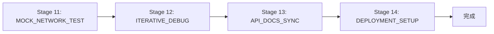

# Nexa-net 剩余阶段实施计划

## 概述

本文档规划了 Nexa-net 工程流水线的剩余阶段 (Stages 11-14)，包括集成测试、调试修复、API 文档同步和部署配置。

---

## Stage 11: MOCK_NETWORK_TEST

### 目标
模拟多 Agent 互相发现与通信的集成测试

### 实施步骤

1. **创建测试框架**
   - 创建 `tests/integration/` 目录
   - 实现模拟网络拓扑
   - 创建测试 fixtures

2. **核心测试场景**
   - **场景 1: 双 Agent 通信**
     - Agent A 注册能力
     - Agent B 发现并调用
     - 验证收据生成
   
   - **场景 2: 多 Agent 服务发现**
     - 3+ Agent 注册不同能力
     - 语义路由选择最优提供者
     - 验证路由决策
   
   - **场景 3: 状态通道生命周期**
     - 开启通道
     - 多次微交易
     - 关闭通道结算

3. **测试文件结构**
   ```
   tests/
   ├── integration/
   │   ├── mod.rs
   │   ├── network_test.rs      # 网络拓扑测试
   │   ├── discovery_test.rs    # 服务发现测试
   │   ├── channel_test.rs      # 通道测试
   │   └── e2e_test.rs          # 端到端测试
   └── fixtures/
       ├── test_agents.rs       # 测试 Agent 定义
       └── test_capabilities.rs # 测试能力定义
   ```

4. **验证点**
   - DID 生成与验证
   - 能力注册与发现
   - RPC 调用成功
   - 收据签名验证
   - 通道余额正确

---

## Stage 12: ITERATIVE_DEBUG

### 目标
分析报错日志，自主修复 Bug

### 实施步骤

1. **运行所有测试**
   ```bash
   cargo test --all
   cargo test -- --ignored  # 运行忽略的测试
   ```

2. **分析失败测试**
   - 记录错误信息
   - 定位问题代码
   - 修复并验证

3. **常见问题检查清单**
   - [ ] 类型不匹配
   - [ ] 未使用的变量/导入
   - [ ] 异步运行时问题
   - [ ] 死锁/竞态条件
   - [ ] 内存泄漏

4. **修复流程**
   ```
   发现问题 → 记录到 PROGRESS.md → 分析根因 → 实施修复 → 验证测试
   ```

---

## Stage 13: API_DOCS_SYNC

### 目标
对齐代码与 API_REFERENCE.md

### 实施步骤

1. **审查现有 API 文档**
   - 读取 `docs/API_REFERENCE.md`
   - 对比实际实现

2. **更新文档内容**
   - REST API 端点
   - gRPC 服务定义
   - SDK 使用示例
   - 错误码定义

3. **生成 API 文档**
   ```bash
   cargo doc --no-deps --open
   ```

4. **同步检查清单**
   - [ ] `/api/v1/call` 端点文档
   - [ ] `/api/v1/register` 端点文档
   - [ ] `/api/v1/discover` 端点文档
   - [ ] `/api/v1/channels` 端点文档
   - [ ] `/api/v1/balance` 端点文档
   - [ ] SDK 示例代码
   - [ ] 错误响应格式

---

## Stage 14: DEPLOYMENT_SETUP

### 目标
生成 Dockerfile、docker-compose.yaml

### 实施步骤

1. **创建 Dockerfile**
   ```dockerfile
   # 多阶段构建
   FROM rust:1.70 AS builder
   # ... 构建步骤
   
   FROM debian:bookworm-slim
   # ... 运行时配置
   ```

2. **创建 docker-compose.yaml**
   ```yaml
   version: '3.8'
   services:
     nexa-proxy:
       build: .
       ports:
         - "7070:7070"
         - "7071:7071"
   ```

3. **创建部署文件结构**
   ```
   deployments/
   ├── docker/
   │   ├── Dockerfile
   │   ├── docker-compose.yaml
   │   └── .dockerignore
   └── kubernetes/
       ├── namespace.yaml
       ├── deployment.yaml
       ├── service.yaml
       └── configmap.yaml
   ```

4. **配置文件**
   - 环境变量配置
   - 日志配置
   - 健康检查配置

---

## 执行顺序



---

## 预期产出

| 阶段 | 产出物 |
|------|--------|
| Stage 11 | `tests/integration/*.rs` - 集成测试套件 |
| Stage 12 | 修复的 Bug 列表，更新的 PROGRESS.md |
| Stage 13 | 更新的 `docs/API_REFERENCE.md` |
| Stage 14 | `deployments/docker/*`, `deployments/kubernetes/*` |

---

## 风险与缓解

| 风险 | 缓解措施 |
|------|---------|
| 集成测试复杂度高 | 从简单场景开始，逐步增加复杂度 |
| 异步测试调试困难 | 使用 tracing 日志，添加超时处理 |
| Docker 镜像过大 | 使用多阶段构建，alpine 基础镜像 |

---

*创建时间: 2026-03-31*